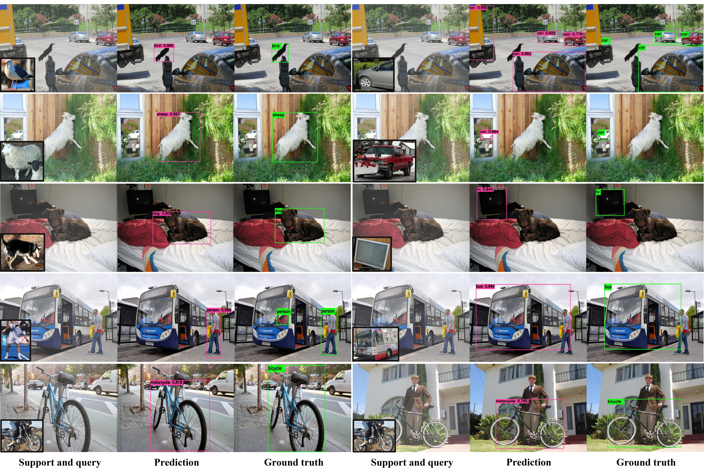

# Dual-awareness Attention for Few-shot Object Detection
<!--  -->


<!-- TABLE OF CONTENTS -->
<details open="open">
  <summary>Table of Contents</summary>
  <ol>
    <li>
      <a href="#introduction">Introduction</a>
    </li>
    <li>
      <a href="#getting-started">Getting Started</a>
      <ul>
        <li><a href="#prerequisites">Prerequisites</a></li>
        <li><a href="#data-preparation">Data Preparation</a></li>
        <li><a href="#pretrained-weights">Pretrained Weights</a></li>
        <li><a href="#installation">Installation</a></li>
      </ul>
    </li>
    <li><a href="#train">Train</a></li>
    <li><a href="#inference">Inference</a></li>
    <li><a href="#acknowledgements">Acknowledgements</a></li>
  </ol>
</details>

<!-- INTRODUCTION -->
## Introduction

While recent progress has significantly boosted few-shot classification (FSC) performance, few-shot object detection (FSOD) remains challenging for modern learning systems.
Therefore, we propose DAnA (Dual-awareness Attention) mechanism which is adaptable to various existing object detection networks and enhances FSOD performance by paying adaptable attention to support images conditioned on given query information. The proposed method achieves SOTA results on COCO benchmark, outperforming the strongest baseline by 47% on performance.\
paper link: https://arxiv.org/abs/2102.12152

<br />
<p align="center">
  <a href="https://github.com/Tung-I/Dual-awareness-Attention-for-Few-shot-Object-Detection
">
    
  </a>
</p>

<!-- GETTING STARTED -->
## Getting Started
### Prerequisites
* Python 3.6
* Cuda 10.0 or 10.1
* Pytorch 1.2.0 or higher

### Data Preparation
1. First, clone the repository and create a data folder:
```
cd Dual-awareness-Attention-for-Few-shot-Object-Detection && mkdir data
```
2. Download the COCO dataset. Please follow the instruction in [py-faster-rcnn](https://github.com/rbgirshick/py-faster-rcnn#beyond-the-demo-installation-for-training-and-testing-models).
Create the symlinks to datasets.
```
$ cd data

For VOC 2007
$ ln -s [your-path-to]/VOC2007/VOCdevkit VOCdevkit2007

For COCO
$ ln -s [your-path-to]/coco coco
```

3. However, the COCO dataset must be preprocessed to conform to the problem setting of FSOD. At training, we must remove the labels of novel instances in each query image. For testing, we should fix the target category of each query image to ensure the results are reproducible.\
Here we provide the preprocessed .json files of COCO for both training and testing. Users can process the COCO annotation by themselves as well.\
* 60 base classes for training (https://drive.google.com/file/d/10mXvdpgSjFYML_9J-zMDLPuBYrSrG2ub/view?usp=sharing)
* 20 novel classes for testing (https://drive.google.com/file/d/1FZJhC-Ob-IXTKf5heNeNAN00V8OUJXi2/view?usp=sharing)
To use them, one can simply put the folder into COCO annotations.
```
$ mv coco60_train [yout-path-to]/coco/annotations/coco60_train 
```
For those who want to apply customized annotations, please refer to lib/datasets/factory.py and lib/datasets/coco_split.py.

4. At training, the support images we use are patches randomly cropped from other query images according to box annotations. At testing, however, we would like to ensure the results are reproducible, so prepare a set of support images of 80 categories in advance, which is available [here](https://drive.google.com/file/d/1nl9-DEpBBJ5w6hxVdijY6hFxoQdz8aso/view?usp=sharing).\
To use them:
```
Create the soft link of support imgs 
$ ln -s /your/path/to/supports supports
```

5. Create the folder to save model weights
```
$ mkdir models
```

### Pretrained Weights
1.Backbone Networks\
Please download the pretrained backbone models (e.g., res50, vgg16) and put them into data/pretrained_model. 
```
$ mkdir data/pretrained_model && cd data/pretrained_model
$ ln -s /your/path/to/res50.pth res50.pth
```
**NOTE**. We would suggest to use Caffe pretrained models to reproduce our results.
**If you want to use pytorch pre-trained models, please remember to transpose images from BGR to RGB, and also use the same data transformer (minus mean and normalize) as used in pretrained model.**

2. Model Weights\
The pretrained weights of DAnA can be download [here](https://drive.google.com/file/d/1JaYF-Ep-C6b5X01_e9tFRzFgRXMJQYQ7/view?usp=sharing).
```
$ cd models
$ ln -s [your-path-to]/DAnA_COCO_ft30 DAnA_COCO_ft30
```

### Installation
Install the environment.
```
$ conda env create -f env.yml
$ source activate [NAME_OF_THE_ENV]
```
Compile COCO API.
```
$ cd lib
$ git clone https://github.com/pdollar/coco.git 
$ cd coco/PythonAPI
$ make && make install
put pycocotools under data/
$ mv cocoapi/PythonAPI/pycocotools .
```
Compile the cuda dependencies using following commands.
```
$ cd lib
$ python setup.py build develop
```
If you are confronted with error during the compilation, you might miss to export the CUDA paths to your environment.

## Train

```
To train from scratch
$ python train.py --dataset coco_base --flip --net DAnA --lr 0.001 --lr_decay_step 12 --bs 4 --epochs 16 --disp_interval 20 --save_dir models/DAnA --way 2 --shot 3 

To resume
$ python train.py --dataset coco_base --flip --net DAnA --lr 0.001 --lr_decay_step 12 --bs 4 --epochs 16 --disp_interval 20 --save_dir models/DAnA --way 2 --shot 3 --r --load_dir models/DAnA --checkepoch 12 --checkpoint 4307
```

## Inference
```
$ python inference.py --eval --dataset val2014_novel --net DAnA --r --load_dir models/DAnA_coco_ft30 --checkepoch 4 --checkpoint 299 --bs 1 --shot 3 --eval_dir dana
```

## Attention Visualization
<br />
<p align="center">
  <a href="https://github.com/Tung-I/Dual-awareness-Attention-for-Few-shot-Object-Detection
">
    
  </a>
</p>

## Acknowledgements
The project is mainly build on [faster-rcnn.pytorch](https://github.com/jwyang/faster-rcnn.pytorch/tree/pytorch-1.0).
